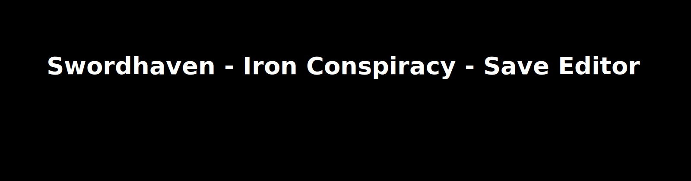
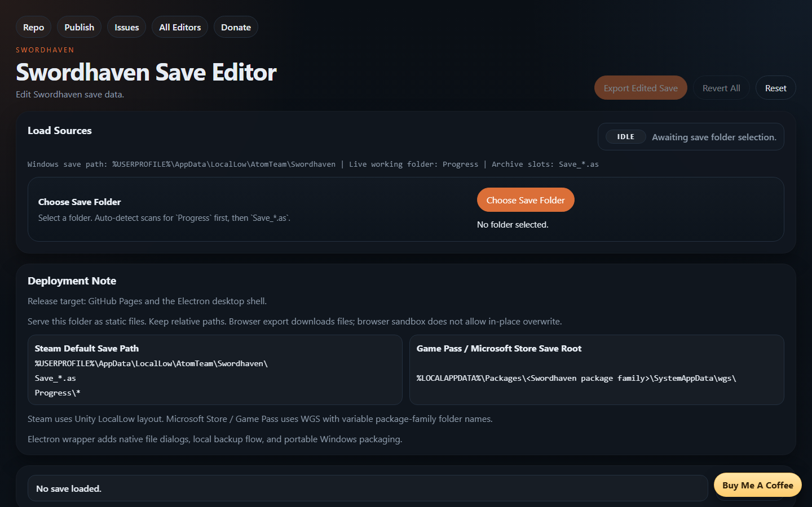

# Swordhaven - Save Editor

`r`n

  

A local-first Swordhaven save editor with safe export workflows and clear profile/record/map editing surfaces.

Use editor without downloading [HERE](https://saveeditors.github.io/swordhaven-save-editor/)

All editors homepage: [`https://saveeditors.github.io/`](https://saveeditors.github.io/)

Have a request for a new save editor? [Request it here!](https://whispermeter.com/message-box/15b6ac70-9113-4e9c-b629-423f335c7e07)

## What You Can Edit Right Now

- Core profile values surfaced in the `Core` workspace.
- Record-level values and state fields in the `Records` workspace.
- Map/fog-of-war values and related quick actions in the `Maps` workspace.
- Save payload inspection, change tracking, and export workflows.

## Not Confirmed / Not Exposed Yet

- Fields not exposed in current UI panels remain untouched by default.
- Unknown/internal values stay hidden until they are validated.
- Unsupported save variants may require additional format mapping.

## Quick Start (PowerShell)

Run from this folder:

- `python -m http.server 8080`

Then open `http://127.0.0.1:8080`.

## Save Paths (Windows)

- Steam: `%USERPROFILE%\AppData\LocalLow\AtomTeam\Swordhaven\`
- Game Pass / Microsoft Store: `%LOCALAPPDATA%\Packages\<Swordhaven package family>\SystemAppData\wgs\`

## Notes

- Keep backup-first export enabled before writing modified saves.
- Close the game and cloud-sync processes before edits and relaunch after save.
- The editor is built for local processing and does not upload saves to a remote service.

What this does not do yet: it does not auto-map every unknown internal Swordhaven value.

